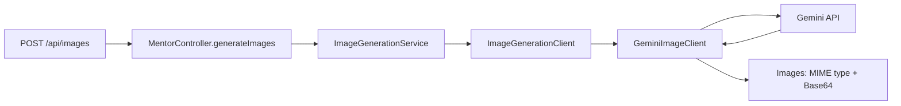

# GameDev Mentor API

Java and Spring Boot backend for contextual and pedagogical mentoring in Game Development.

The project combines deterministic game-project inspection with generative AI to help students investigate bugs, understand programming logic, and develop autonomy instead of simply receiving ready-made solutions.

> **Status:** Functional multi-engine MVP with a separate text-to-image API, provider abstractions, and automated image-generation tests. Project inspection is evolving toward stronger validation and structured models.

---

## Overview

GameDev Mentor receives a student's question together with an optional game project.

The backend identifies the project format, selects the appropriate interpreter, extracts relevant project information, combines that context with the student's question, and sends the resulting prompt to the configured AI provider.

Currently supported engines:

| Engine | Project format | Current inspection |
|---|---|---|
| Scratch | `.sb3` | `project.json` |
| Construct 3 | `.c3p` | project, object types, layouts and event sheets |
| GameMaker | `.yyz` | project, objects, rooms, sprites and GML source code |

The raw project archive is not sent directly to the AI provider.

The backend controls which information is extracted and included in the mentoring context.

---

## Pedagogical Principle

> **AI should amplify student autonomy, not replace the learning process.**

The mentor should prioritize:

- hypotheses;
- debugging directions;
- investigative questions;
- conceptual explanations;
- progressive hints.

Instead of immediately solving the problem, the system should help the student understand what to inspect, why something may be happening, and how to reach the solution.

---

## Current MVP

The current version includes:

- Java;
- Spring Boot REST API;
- Gemini integration;
- provider abstraction through `TextGenerationClient`;
- image generation through the independent `ImageGenerationClient` abstraction;
- Gemini image adapter with configurable model, timeouts, and normalized errors;
- synchronous HTTP integration;
- `multipart/form-data` requests;
- optional project uploads;
- centralized project interpreter resolution;
- Scratch `.sb3` support;
- Construct 3 `.c3p` support;
- GameMaker `.yyz` support;
- upload size validation;
- pedagogical base prompt;
- text-only mentoring when no project is attached;
- simple browser interface for manual testing.

---

## Current Flow

```text
Student question
      +
optional project
(.sb3 / .c3p / .yyz)
      |
      v
MentorController
      |
      v
MentorService
      |
      v
ProjectInterpreterService
      |
      v
List<ProjectInterpreter>
      |
      +----------------+----------------+
      |                |                |
      v                v                v
   Scratch         Construct 3       GameMaker
Interpreter        Interpreter       Interpreter
      |                |                |
      +----------------+----------------+
                       |
                       v
                Project context
                       |
                       +
                Student question
                       |
                       v
             TextGenerationClient
                       |
                       v
                GeminiTextClient
                       |
                       v
                   Gemini
                       |
                       v
              Mentor response
```

---

# Architecture

## `MentorController`

Responsible for HTTP concerns.

Main responsibilities:

- expose multipart chat at `/api/chat` and JSON image generation at `/api/images`;
- receive the student's prompt;
- receive the optional project file for chat;
- delegate the request to the service layer;
- return the response.

Parsing rules and AI-provider details should remain outside the controller.

---

## `MentorService`

Coordinates the mentoring flow.

Responsibilities:

- build the pedagogical base prompt;
- detect whether a project was attached;
- request project interpretation;
- combine project context and student question;
- call the text generation abstraction.

The service does not need to know how Scratch, Construct, or GameMaker projects are internally structured.

---

## `ProjectInterpreter`

Common contract for all supported project interpreters.

```java
public interface ProjectInterpreter {

    boolean supports(String _fileExtension);

    String interpret(MultipartFile _file);
}
```

Each implementation decides which extension it supports and how that project format should be inspected.

---

## `ProjectInterpreterService`

Responsible for:

- validating uploaded files;
- identifying the project extension;
- selecting the correct interpreter.

Spring injects all implementations of:

```java
ProjectInterpreter
```

into:

```java
List<ProjectInterpreter>
```

The interpreter is selected dynamically through:

```java
interpreter.supports(fileExtension)
```

This allows new engines to be added without creating engine-specific conditions inside the main mentoring flow.

Current implementations:

```text
ProjectInterpreter
├── ScratchInterpreterService
├── ConstructInterpreterService
└── GameMakerInterpreterService
```

---

# Supported Project Formats

## Scratch `.sb3`

Scratch projects are ZIP packages.

The current interpreter locates:

```text
project.json
```

and extracts it as text.

```text
project.sb3
    |
    v
ZIP inspection
    |
    v
project.json
    |
    v
AI context
```

A semantic Scratch parser is intentionally postponed.

---

## Construct 3 `.c3p`

Construct 3 project files are ZIP packages containing several JSON resources.

The current interpreter extracts the essential project structure:

```text
project.c3proj

objectTypes/
    *.json

layouts/
    *.json

eventSheets/
    *.json
```

UI state files such as:

```text
*.uistate.json
```

are ignored.

The resulting context contains:

```json
{
  "project": {},
  "objectTypes": [],
  "layouts": [],
  "eventSheets": []
}
```

This provides the AI with information about:

- project configuration;
- objects;
- layouts;
- variables;
- conditions;
- actions;
- event logic.

---

## GameMaker `.yyz`

GameMaker `.yyz` files are compressed project packages.

A GameMaker project contains a main `.yyp` file together with several `.yy` resources and GML source files.

The current interpreter intentionally focuses on the essential resources.

### Project

```text
*.yyp
```

### Objects

```text
objects/**/*.yy
```

### Rooms

```text
rooms/**/*.yy
```

### Sprites

```text
sprites/**/*.yy
```

### GML code

```text
**/*.gml
```

Other resources such as images, build options, and IDE metadata are currently ignored.

The resulting context follows this structure:

```json
{
  "project": {},
  "objects": [],
  "rooms": [],
  "sprites": [],
  "code": []
}
```

GML files preserve both their project path and source code:

```json
{
  "file": "objects/obj_player/Step_0.gml",
  "content": "..."
}
```

This is important because the source location provides context about which object or resource owns the code.

GameMaker `.yy` and `.yyp` resources are normalized using Jackson before being included in the resulting context.

GML source code is wrapped into JSON objects so characters such as quotes and line breaks are escaped safely.

---

# Interpreter Extensibility

Adding another engine should require implementing only:

```java
ProjectInterpreter
```

Example:

```java
@Service
public class ExampleInterpreterService
        implements ProjectInterpreter {

    @Override
    public boolean supports(String _fileExtension) {
        return "example".equalsIgnoreCase(_fileExtension);
    }

    @Override
    public String interpret(MultipartFile _file) {
        // project inspection
    }
}
```

Spring automatically includes the new implementation in:

```java
List<ProjectInterpreter>
```

No engine-specific `switch` is required inside `ProjectInterpreterService`.

---

# AI Provider Abstraction

The main application depends on:

```java
public interface TextGenerationClient {

    String generateResponse(String _prompt);
}
```

The current implementation is:

```text
GeminiTextClient
```

This keeps Gemini-specific integration outside the mentoring domain.

Conceptually:

```text
MentorService
      |
      v
TextGenerationClient
      |
      v
GeminiTextClient
      |
      v
Gemini API
```

Other providers can be introduced later without changing the central mentoring flow.

---

# Image Generation Architecture

The starting point for `feat/image-generator` is commit `42b0ffe` (the multi-engine MVP on `main`). It already separates HTTP controllers, services, and the text-provider boundary, but has no image contract and only an application-context smoke test.

The image feature follows those existing layers. Text and image generation have separate contracts because text mentoring returns an answer while image generation returns binary assets. A shared generic AI client would couple unrelated request and response formats.



| Component | Responsibility |
|---|---|
| `MentorController` | Expose `/api/chat` and `/api/images` as separate methods; the image endpoint accepts JSON and returns a synchronous response with `Cache-Control: no-store`. |
| `ImageGenerationService` | Validate and normalize the prompt, call the provider once, reject empty results. |
| `ImageGenerationClient` | Define the provider-independent image-generation contract. |
| `GeminiImageClient` | Map requests to Gemini, extract final image parts, validate MIME/Base64, normalize upstream failures. |
| `ImageGenerationConfiguration` | Select the provider and configure a dedicated HTTP client and timeouts. |
| `ImageGenerationExceptionHandler` | Map image errors to stable HTTP responses; generic input errors are handled only for the method receiving `ImageGenerationRequest`, preserving chat error handling. |

```java
public interface ImageGenerationClient {
    ImageGenerationResponse generateImages(String _prompt);
}

public record GeneratedImage(String mimeType, String data) {}
public record ImageGenerationResponse(List<GeneratedImage> images) {}
```

`ImageGenerationResponse` defensively copies its image list. The public response contains no Gemini-specific fields. Gemini transport records are separate from the existing text DTOs, and `MentorService` continues to depend only on `TextGenerationClient`.

Image creation is an explicit request from the student. The chat does not automatically create assets or send uploaded projects to the image provider. The student supplies the visual brief; the mentoring prompt and project interpreters remain part of the chat flow.

## Initial Scope and Tradeoffs

- Text-to-image only, with a required prompt of at most 4,000 Java string characters (UTF-16 code units), measured before trimming. Leading/trailing whitespace is removed before the provider call.
- Synchronous, stateless processing fits the current application. No database, generated files, object storage, or queue is required.
- Responses contain all final image parts from the first candidate. Text and intermediate `thought` parts are ignored. A text-only or malformed provider response is an error.
- Supported output MIME types are `image/png`, `image/jpeg`, and `image/webp`; Base64 must decode to nonempty bytes. This validates the transport representation, not the image's visual quality or pixel contents.
- Model, provider, and credentials are server configuration, not client request fields.
- There are no automatic retries or provider fallbacks: repeating a generation may incur another charge.

Base64 increases response size and is buffered in memory. As usage grows, introduce response-size/concurrency limits, authentication and per-user quotas, then asynchronous jobs and object storage if needed. Editing, aspect-ratio controls, transparency guarantees, pixel dimensions, and deterministic sprite sheets are outside this first contract. The browser test page supports both chat and image generation: select the image mode to send a prompt, preview the returned images, and download them.

## Provider Configuration

| Property | Environment variable | Default |
|---|---|---|
| `image.generation.provider` | `IMAGE_GENERATION_PROVIDER` | `gemini` |
| `gemini.api.key` | `GEMINI_API_KEY` | Required for real provider calls |
| `gemini.api.base-url` | Spring property override | `https://generativelanguage.googleapis.com` |
| `gemini.image.model` | `GEMINI_IMAGE_MODEL` | `gemini-3.1-flash-lite-image` |
| `gemini.image.connect-timeout` | `GEMINI_IMAGE_CONNECT_TIMEOUT` | `10s` |
| `gemini.image.read-timeout` | `GEMINI_IMAGE_READ_TIMEOUT` | `120s` |

The image model is independent of `gemini.api.model`, which remains the text model. The image HTTP client uses the existing Gemini base URL and API key but has its own timeouts and is not registered as a second `RestClient` bean. Only `gemini` is currently implemented; an unregistered provider prevents application startup instead of silently selecting another provider.

The adapter uses `POST /v1/models/{model}:generateContent`, requests `TEXT` and `IMAGE` modalities, and reads `inlineData.mimeType` and `inlineData.data`. See the [official Gemini image-generation documentation](https://ai.google.dev/gemini-api/docs/generate-content/image-generation) for the provider contract and model availability. Real generation requires access to the configured model and available quota.

To add another provider:

1. Implement `ImageGenerationClient` using that provider's own transport DTOs.
2. Return validated `GeneratedImage` records and translate failures into `ImageGenerationException` reasons.
3. Register the implementation as a Spring bean conditional on its `image.generation.provider` value, so exactly one client is active.
4. Add HTTP contract and configuration tests, then select it through `IMAGE_GENERATION_PROVIDER`.

The controller, service, and public response schema do not need provider-specific changes.

---

# Endpoints

## Text Mentoring

The main endpoint accepts:

```http
POST /api/chat
Content-Type: multipart/form-data
```

Request:

```text
prompt = "My character does not jump. What should I investigate?"

file = project.sb3
```

or:

```text
file = project.c3p
```

or:

```text
file = project.yyz
```

The file is optional.

Without an attached project, GameDev Mentor behaves as a text-only mentor.

---

## Image Generation

```http
POST /api/images
Content-Type: application/json
Accept: application/json

{
  "prompt": "Create a pixel-art forest background for a platform game."
}
```

Example using Bash:

```bash
curl -X POST http://localhost:8080/api/images \
  -H 'Content-Type: application/json' \
  -d '{"prompt":"Create a pixel-art forest background for a platform game."}'
```

Example using PowerShell:

```powershell
$body = @{ prompt = 'Create a pixel-art forest background for a platform game.' } | ConvertTo-Json
$result = Invoke-RestMethod -Method Post -Uri 'http://localhost:8080/api/images' `
    -ContentType 'application/json' -Body $body
```

A successful response is HTTP `200` with this structure (`data` is abbreviated below):

```json
{
  "images": [
    {
      "mimeType": "image/png",
      "data": "iVBORw0KGgo..."
    }
  ]
}
```

`data` is raw Base64, without a `data:` prefix. Consumers can decode it to bytes or construct `data:${mimeType};base64,${data}` for display. The number of images is determined by the provider response.

Image errors have a stable code and a safe, human-readable message:

```json
{
  "code": "INVALID_IMAGE_REQUEST",
  "message": "Envie um JSON com prompt não vazio de até 4000 caracteres."
}
```

| HTTP status | Code | Meaning |
|---|---|---|
| `400` | `INVALID_IMAGE_REQUEST` | Missing/invalid JSON, missing/blank prompt, or prompt longer than 4,000 characters. |
| `422` | `IMAGE_GENERATION_BLOCKED` | Provider explicitly blocked the prompt or generated content. |
| `429` | `IMAGE_PROVIDER_RATE_LIMITED` | Per-minute throttling, or an unspecified quota/capacity restriction; does not prove the allowance was consumed. |
| `429` | `IMAGE_PROVIDER_QUOTA_UNAVAILABLE` | Provider explicitly reported a quota value of zero. |
| `429` | `IMAGE_PROVIDER_QUOTA_EXHAUSTED` | Daily or another identified resource quota was exceeded. |
| `503` | `IMAGE_PROVIDER_BILLING_REQUIRED` | Provider explicitly reported disabled billing for the key's project. |
| `503` | `IMAGE_PROVIDER_CREDITS_EXHAUSTED` | Provider explicitly reported depleted prepayment credits. |
| `503` | `IMAGE_PROVIDER_API_DISABLED` | Provider reported that the API is disabled in the key's project. |
| `502` | `IMAGE_PROVIDER_AUTHENTICATION_FAILED` | Upstream rejected the configured credentials. |
| `502` | `IMAGE_PROVIDER_ACCESS_DENIED` | Upstream denied access, including API-key restrictions. |
| `502` | `IMAGE_PROVIDER_MODEL_NOT_FOUND` | Upstream returned 404 for the configured model/operation. |
| `502` | `IMAGE_PROVIDER_INVALID_RESPONSE` | Missing images, malformed JSON, invalid MIME/Base64, or incomplete generation. |
| `503` | `IMAGE_PROVIDER_UNAVAILABLE` | Other provider HTTP failures, or connection failure. |
| `504` | `IMAGE_PROVIDER_TIMEOUT` | Provider request timed out. |

Unsupported content types receive Spring MVC's standard `415` response. Provider response bodies, prompts, and credentials are not included in image error messages. This error contract applies to `/api/images`; existing chat errors retain their behavior.

### Diagnose Image Provider Errors

The browser already displays the API's `message`, so the specific guidance appears without a frontend change. After restarting the application, make one image request and inspect that message. The terminal also logs `Image provider failure` with the classified reason and filtered diagnostic fields. In the browser's developer tools, Network → `/api/images` → Response exposes the same structured facts under optional `diagnostics`:

```json
{
  "code": "IMAGE_PROVIDER_QUOTA_UNAVAILABLE",
  "message": "O provedor informou cota zero para a geração de imagens. ...",
  "diagnostics": {
    "httpStatus": 429,
    "providerStatus": "RESOURCE_EXHAUSTED",
    "model": "gemini-3.1-flash-image",
    "quotas": [
      {
        "metric": "generativelanguage.googleapis.com/generate_content_free_tier_requests",
        "id": "GenerateRequestsPerDayPerProjectPerModel-FreeTier",
        "limit": 0,
        "model": "gemini-3.1-flash-image"
      }
    ]
  }
}
```

This example is synthetic and its `message` is abbreviated. Missing facts are omitted rather than guessed. A missing quota value is **not** zero. A free-tier quota in the response adds guidance to check the project of the active key; it does not prove that the key belongs to the wrong project.

`GeminiImageErrorMapper` interprets the `generateContent` error envelope and the typed Google RPC `ErrorInfo`, `QuotaFailure`, and `RetryInfo` details. Known error reasons are accepted only from Google's documented infrastructure/service domains. A narrow compatibility fallback recognizes explicit quota sentences (`Quota exceeded for metric: ..., limit: 0`) and the specific prepayment-depletion message when structured information is absent. Generic advice to check billing is never enough to classify a billing failure. See the [Google RPC error detail definitions](https://github.com/googleapis/googleapis/blob/master/google/rpc/error_details.proto), [Google infrastructure error reasons](https://github.com/googleapis/googleapis/blob/master/google/api/error_reason.proto), and [Gemini billing guide](https://ai.google.dev/gemini-api/docs/billing).

Diagnostics contain only filtered status/reason, model, quota identifiers/values, and a provider retry hint when supplied. No raw provider message, metadata, project identifiers, debug stack, prompt, API key, or provider links are returned or logged. Error parsing is limited to 64 KiB and 20 quota violations; malformed or larger bodies retain a safe HTTP-based fallback.

Positive `RetryInfo` durations are rounded up to seconds and combined with `Retry-After` using the longer delay. The endpoint sends a `Retry-After` header only for `IMAGE_PROVIDER_RATE_LIMITED`, never as a proposed fix for zero quota, daily quota, or billing failures. A provider hint may still appear in `diagnostics` for investigation. No request is retried automatically.

---

# Upload Validation

The current application validates:

- empty files;
- maximum upload size;
- file extension;
- availability of an interpreter for the extension.

Current upload limit:

```text
10 MB
```

Supported extensions:

```text
.sb3
.c3p
.yyz
```

---

# Security

Uploaded project files must always be treated as untrusted input.

Current protections include:

- maximum archive upload size;
- controlled interpreter selection;
- project format validation;
- backend-only provider credentials;
- no direct exposure of API keys to the browser.

Archive hardening is still an active engineering task.

Future improvements include:

- archive entry count limits;
- decompressed-size limits;
- per-entry size limits;
- ZIP bomb protection;
- stronger corrupted archive validation;
- application-specific project exceptions;
- centralized HTTP error handling.

The current interpreters still use archive-entry reads that should eventually receive decompressed-size protection.

---

# Privacy

Real student information must never be committed to the public repository.

Do not commit:

- student names;
- student conversations;
- private student projects;
- school credentials;
- internal institutional URLs;
- API keys;
- access tokens;
- private institutional documents.

Tests should use synthetic or sanitized fixtures.

---

# Current Limitations

Project interpretation currently prioritizes useful context extraction rather than full semantic parsing.

### Scratch

Currently extracts:

```text
project.json
```

No semantic block model yet.

### Construct 3

Currently extracts relevant project JSON resources.

There is no dedicated Java domain model yet.

### GameMaker

Currently extracts:

- project metadata;
- objects;
- rooms;
- sprites;
- GML source code.

The interpreter does not currently build:

- GML ASTs;
- symbol tables;
- variable graphs;
- call graphs;
- object relationships;
- semantic code models.

These capabilities may be introduced only when they provide clear value to mentoring.

---

# Immediate Engineering Roadmap

## Project Models

Replace manually assembled JSON strings incrementally with structured Java models using records where useful.

Possible direction:

```text
ScratchProject
ConstructProject
GameMakerProject
```

---

## Error Handling

Introduce application-specific exceptions and:

```java
@RestControllerAdvice
```

Possible errors:

```text
INVALID_PROJECT_FILE
UNSUPPORTED_PROJECT_FORMAT
INVALID_SCRATCH_PROJECT
INVALID_CONSTRUCT_PROJECT
INVALID_GAMEMAKER_PROJECT
AI_PROVIDER_RATE_LIMITED
AI_PROVIDER_UNAVAILABLE
AI_PROVIDER_TIMEOUT
INTERNAL_ERROR
```

---

## Archive Security

Add:

- maximum entry count;
- decompressed-size limits;
- resource size limits;
- corrupted archive validation;
- ZIP bomb protection.

---

## Automated Tests

Image-generation tests cover service validation/delegation, JSON endpoint behavior, normalized errors, Gemini request/response mapping, invalid provider content, timeouts, and provider configuration. Chat regression tests cover multipart requests with and without a project. All provider interactions are mocked and the context test uses a synthetic key.

Additional project-inspection coverage is still needed for:

```text
ScratchInterpreterService
ConstructInterpreterService
GameMakerInterpreterService
ProjectInterpreterService
MentorService
MentorController
```

Important scenarios:

- supported project;
- unsupported extension;
- empty file;
- oversized file;
- malformed archive;
- missing root project file;
- malformed JSON resource;
- valid GML extraction.

CI should eventually execute:

```bash
./mvnw verify
```

for every Pull Request.

---

# Future Product Roadmap

Possible future capabilities include:

- structured project Records;
- richer GameMaker GML analysis;
- deeper Construct project relationships;
- teacher and student mentoring profiles;
- persistent user data;
- pedagogical personalization;
- image editing and asynchronous asset generation;
- audio generation;
- multi-provider AI routing;
- IDE integrations;
- Unity project inspection;
- larger asynchronous analysis workflows.

These should be introduced incrementally according to demonstrated product needs.

---

# Development Workflow

## Run Locally

Install JDK 25 or newer. The Maven wrapper supplies Maven.

```bash
export GEMINI_API_KEY='your-local-key'
./mvnw spring-boot:run
```

On Windows PowerShell:

```powershell
$env:GEMINI_API_KEY = 'your-local-key'
.\mvnw.cmd spring-boot:run
```

Keep real keys in your local environment. The application serves the chat and image generation test page at `http://localhost:8080/`.

## Verify Locally

```bash
./mvnw verify
```

```powershell
.\mvnw.cmd verify
```

No real API key or provider call is needed for the test suite. Maven may download dependencies on the first run. Tests validate the integration contract with simulated HTTP responses; they do not verify real model access or generated image quality.

Prefer short-lived and focused branches.

Examples:

```text
feat/gamemaker-interpreter
feat/image-generator
feat/project-records
fix/archive-validation
test/project-interpreters
feat/api-exception-handler
docs/update-readme
```

---

## Conventional Commits

Commit messages should be concise and preferably written in English.

Examples:

```text
feat(interpreter): add GameMaker project support

feat(interpreter): add Construct project support

refactor(interpreter): resolve project interpreters dynamically

fix(scratch): correct project reading error

test(gamemaker): cover YYZ project interpretation

docs: update supported project formats
```

Avoid vague messages such as:

```text
updates
changes
final
fix stuff
finish project
```

---

## Before Each Commit

```bash
git status
git diff
git add -p
git diff --staged
./mvnw verify
git commit
```

Each commit should represent one small, understandable change.

---

# Development Philosophy

The project follows a few core principles:

- keep external integrations at system boundaries;
- inspect projects deterministically before sending context to AI;
- keep engine-specific logic inside dedicated interpreters;
- prefer simple abstractions with clear responsibilities;
- treat uploaded files as hostile input;
- never expose credentials to clients;
- preserve student autonomy as a product requirement;
- evolve through small and testable Pull Requests;
- avoid premature semantic parsing;
- keep the code understandable before making it sophisticated.

---

# Current Status

```text
Gemini text mentoring              ✅
Provider abstraction               ✅
Text-only mentoring                ✅
ImageGenerationClient abstraction  ✅
Gemini text-to-image endpoint      ✅
Image validation and error mapping ✅
Automated image-generation tests   ✅
Chat multipart regression tests    ✅

ProjectInterpreter abstraction     ✅
Dynamic interpreter resolution     ✅

Scratch .sb3 support               ✅
Construct 3 .c3p support           ✅
GameMaker .yyz support             ✅

Browser testing interface          ✅
10 MB upload validation            ✅

Structured project Records         ⏳
Global exception handling          ⏳
Automated interpreter tests        ⏳
Archive hardening                  ⏳
CI verification                    ⏳
```

---

## Tech Stack

```text
Java 25
Spring Boot 4
Spring MVC
Jackson
Lombok
Gemini API
Maven
```

---

## Author

Developed as an educational backend experiment focused on applying AI to Game Development mentoring without replacing the student's learning process.
